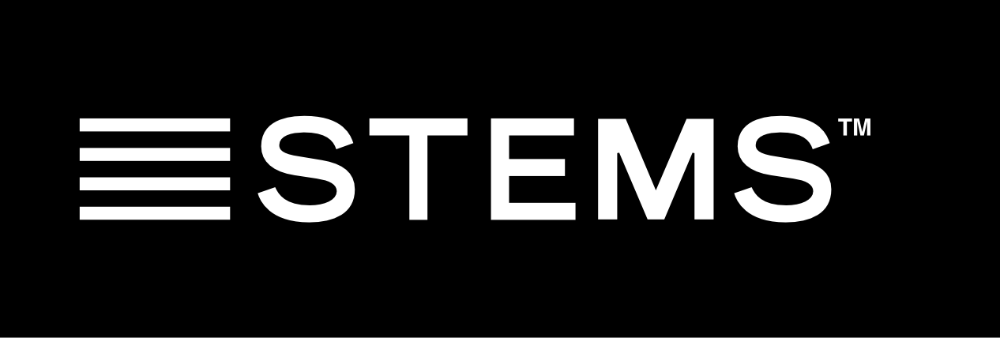

# MUSDB18 dataset [](https://doi.org/10.5281/zenodo.1117372)


The _musdb18_ consists of 150 full lengths music tracks (~10h duration) of different styles along with the images of their constitutive objects.

_musdb18_ contains two folders, a folder with a training set: "train", composed of 100 songs, and a folder with a test set: "test", composed of 50 songs. Supervised approaches should be trained on the training set and tested on both sets.



All files from the _musdb18_ dataset are encoded in the [Native Instruments stems format](http://www.stems-music.com/) (.mp4). It is a multitrack format composed of 5 stereo streams, each one encoded in AAC @256kbps. These signals correspond to:

- `0` - The mixture,
- `1` - The drums,
- `2` - The bass,
- `3` - The rest of the accompaniment,
- `4` - The vocals.

For each file, the mixture correspond to the sum of all the signals. All signals are stereophonic and encoded at 44.1kHz.

The data from _musdb18_ is composed of several different sources:
* 100 tracks are taken from the [DSD100 dataset](http://sisec17.audiolabs-erlangen.de/#/dataset), which is itself derived from [The 'Mixing Secrets' Free Multitrack Download Library](www.cambridge-mt.com/ms-mtk.htm). Please refer to this original resource for any question regarding your rights on your use of the DSD100 data.
* 46 tracks are taken from [the MedleyDB](http://medleydb.weebly.com) licensed under Creative Commons (BY-NC-SA 4.0).
* 2 tracks were kindly provided by Native Instruments originally part of [their stems pack](https://www.native-instruments.com/en/specials/stems-for-all/free-stems-tracks/).
* 2 tracks a from from the Canadian rock band The Easton Ellises as part of the [heise stems remix competition](https://www.heise.de/ct/artikel/c-t-Remix-Wettbewerb-The-Easton-Ellises-2542427.html#englisch), licensed under Creative Commons (BY-NC-SA 3.0).

Have a look at the [detailed list of all tracks](https://github.com/sigsep/sigsep.github.io/blob/master/data/tracklist.csv).

### Download

* [Direct Download Full Dataset (4.4 Gb)](https://www.dropbox.com/s/yxa5hbgunbbje4l/musdb18.zip?dl=1) (MD5: af06762477334799bfc5abf237648207)
* [Direct Download Sample Data (11 MB)](https://www.dropbox.com/s/aihhp0fkboefxy3/mus-sample.zip?dl=1)

### Tools

* [musdb](https://github.com/sigsep/sigsep-mus-db): Python based dataset parser
* [stempeg](https://github.com/faroit/stempeg): STEM reader and writer
* [mus-io](https://github.com/sigsep/sigsep-mus-io): Docker scripts for encoding

### Acknowledgements

We would like to thank Mike Senior, Rachel Bittner, and also Mickael Le Goff, not only for giving us the permission to use this multitrack material, but also for maintaining such resources for the audio community.

#### Authors

- Zafar Rafii
- Antoine Liutkus
- Fabian-Robert Stöter
- Stylianos Ioannis Mimilakis
- Rachel Bittner

### Citation

If you use this dataset, please reference it accordingly:

```
@misc{rafii_zafar_2017_1117372,
  author       = {Rafii, Zafar and
                  Liutkus, Antoine and
                  Fabian-Robert Stöter and
                  Mimilakis, Stylianos Ioannis and
                  Bittner, Rachel},
  title        = {musdb18},
  month        = dec,
  year         = 2017,
  doi          = {10.5281/zenodo.1117372},
  url          = {https://doi.org/10.5281/zenodo.1117372}
}
```
